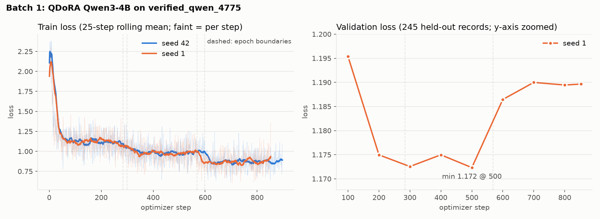

# Training progress

A log of every student training batch: what was run (data, code, config, jobs) and what came out
(loss, judged quality). Newest batch last. Add a section per batch and fill in results as the
evaluation jobs finish; keep numbers as reported by the job outputs, not rounded guesses.

Where results come from (all paths relative to `$REPO` on Leonardo):

| Result | File | Written by |
|---|---|---|
| Train / validation loss per step | `seed_<n>/adapters/step_<N>/adapter/trainer_state.json`, MLflow | `slurm/train.sbatch` |
| Final adapter, config eval set | `seed_<n>/eval_summary.json` | `slurm/evaluate.sbatch` |
| Every kept step, dataset_v1 dev slice | `seed_<n>/adapters/step_<N>/eval_summary.json`, MLflow `dev/...` | `slurm/evaluate_checkpoints.sbatch` |

MLflow store: `$REPO/mlruns`, experiment `distillkit`, one run per seed named after its run dir
(view with `uvx mlflow ui`, see `slurm/README.md`).

## Batch 1: QDoRA on verified_qwen_4775 (2026-10-10)

### Setup

- **Data:** `data/teacher/verified_qwen_4775/verified.jsonl` (PR #25), 4,775 certified teacher
  records, SHA-256 `3f99eefb…`. Tokens per example: median 164, max 1,520; 0 over `max_length`.
- **Student:** `Qwen/Qwen3-4B-Instruct-2507`, QDoRA (`method: dora`, 4-bit).
- **Config:** `configs/qwen3_4b_qdora.yaml`

  | Setting | Value |
  |---|---|
  | lora_r / alpha / dropout | 16 / 32 / 0.0 |
  | learning rate | 1e-4, cosine |
  | epochs | 3 |
  | batch size x grad accum | 4 x 4 (effective 16) |
  | max_length | 2048 |
  | bf16 | yes |
  | save_steps | 100 (newest 2 checkpoints kept) |
  | val_fraction | 0.05 (seeds 1, 2 only) |

- **Hardware:** 1 x A100 per seed (Booster, `boost_usr_prod`), ~3.1 s/step.

### Runs

| Seed | Run dir | Code | Validation split | MLflow | Train job | Steps | Wall time |
|---|---|---|---|---|---|---|---|
| 42 | `runs/verified4775_qdora` | 5873df7 (PR #27) | none (4,775 train) | no | 59911612 | 897 | 51.5 min |
| 1 | `runs/verified4775_qdora_v2` | a15dc23 (PR #28) | 4,530 train / 245 val | yes | 59912914 | 852 | 47.8 min |
| 2 | `runs/verified4775_qdora_v2` | 3738b9b (PR #29) | 4,530 train / 245 val | yes | 59915034 | 852 | running |

Seed 42 ran on the older code: no validation split, no MLflow, and only the last two checkpoints
survive (steps 800, 897), so its per-step dev eval covers just those two.

### Adapter locations

All under `$REPO` = `/leonardo_work/EUHPC_D30_031/alembic/alembic` on Leonardo.

| Seed | Final adapter (+ tokenizer) | Per-step adapters | Resumable checkpoints (newest 2) |
|---|---|---|---|
| 42 | `runs/verified4775_qdora/seed_42/adapter/` | `runs/verified4775_qdora/seed_42/adapters/step_{800,897}/adapter/` (copied by hand from the checkpoints) | `runs/verified4775_qdora/seed_42/checkpoints/checkpoint-{800,897}/` |
| 1 | `runs/verified4775_qdora_v2/seed_1/adapter/` | `runs/verified4775_qdora_v2/seed_1/adapters/step_{100,...,800,852}/adapter/` | `runs/verified4775_qdora_v2/seed_1/checkpoints/checkpoint-{800,852}/` |
| 2 | `runs/verified4775_qdora_v2/seed_2/adapter/` | `runs/verified4775_qdora_v2/seed_2/adapters/step_<N>/adapter/` | `runs/verified4775_qdora_v2/seed_2/checkpoints/` |

The final adapter and the last per-step adapter (step 897 / 852) hold the same weights.

### Training loss

Train loss drops at each epoch boundary (the model sees the same records again), while validation
loss stays within 1.17-1.20 the whole run. Seed 42 has no validation curve (no split). Seed 2 to be
added when it finishes.

Per-step train loss is one batch and noisy; the average is over the whole run.

| Seed | Step 1 | Avg train loss | Token accuracy (start → end) |
|---|---|---|---|
| 42 | 2.11 | 1.009 | 0.63 → ~0.72 |
| 1 | 1.94 | 1.009 | 0.66 → ~0.71 |

Seed 1 validation loss (245 held-out records, every 100 steps):

| Step | 100 | 200 | 300 | 400 | 500 | 600 | 700 | 800 | 852 |
|---|---|---|---|---|---|---|---|---|---|
| Val loss | 1.195 | 1.175 | 1.173 | 1.175 | **1.172** | 1.186 | 1.190 | 1.189 | 1.190 |
| Val token acc | 0.704 | 0.706 | 0.707 | 0.708 | 0.707 | 0.707 | 0.706 | 0.707 | 0.707 |

Validation loss bottoms out around step 300-500 (end of epoch 1 to mid epoch 2) and rises in epoch 3:
the third epoch likely overfits.

### Final adapter, config eval set

`data/eval/eval_all_v2.jsonl` (66 normal) + `data/eval/eval_tools.jsonl` (16 tool), judge
`openai/gpt-oss-20b`, protocol `paired-orders-v2-invalid-incomplete`, 132/132 verdicts valid.

| Metric | Base | Seed 42 | Seed 1 | Seed 2 |
|---|---|---|---|---|
| Win rate vs base (0.5 = tie) | – | **0.341** | **0.307** | pending |
| Check pass rate | 0.955 | 0.864 | 0.864 | |
| Bad-flag rate | 0.025 | 0.255 | 0.324 | |
| Answers with bad flags | 2 | 9 | 8 | |
| Tool decision accuracy | 1.0 | 0.875 | 0.875 | |
| Tool false-call rate | 0.167 | 0.5 | 0.5 | |
| Tool valid / AST / exec ok | 1.0 / 1.0 / 1.0 | 1.0 / 1.0 / 1.0 | 1.0 / 1.0 / 1.0 | |
| Tool grounded rate | 1.0 | 0.923 | 0.923 | |

Jobs: seed 42 `evaluate` 59917194 (its trailing `track` fails: no MLflow run; results are complete),
seed 1 59914593, seed 2 59915059.

**The final student is worse than the base model** on both seeds: it loses the judged comparison,
uses ~10x more invalid command-line flags, and calls tools on half the questions where none is needed.

### Per-step dev eval (dataset_v1 development slice)

106 normal + 23 tool items (`development_normal.jsonl`, `development_tools.jsonl`), same judge and
protocol, 212/212 verdicts valid. Base and student both answer at every step.

**Seed 42** (job 59914860; its trailing `track` fails: no MLflow run; results are complete):

| Metric | Base | Step 800 | Step 897 (final) |
|---|---|---|---|
| Win rate vs base (0.5 = tie) | – | **0.330** | **0.349** |
| Check pass rate | 0.943 | 0.915 | 0.915 |
| Bad-flag rate | 0.029 | 0.211 | 0.250 |
| Answers with bad flags | 3 | 9 | 9 |
| Tool decision accuracy | 0.957 | 0.913 | 0.913 |
| Tool false-call rate | 0.111 | 0.222 | 0.222 |
| Tool first-response pass rate | 0.957 | 0.870 | 0.870 |
| Tool raw call rate | 0.652 | 0.696 | 0.696 |
| Tool valid / AST / exec ok | 1.0 / 1.0 / 1.0 | 1.0 / 0.929 / 1.0 | 1.0 / 0.929 / 1.0 |
| Tool grounded rate | 1.0 | 1.0 | 1.0 |

Same picture as the config eval set: the student loses about 2:1 to the base and adds invalid flags.
Steps 800 and 897 barely differ.

**Seed 1** (job 59916409, steps 100-852) and **seed 2** (job 59915060): pending. Each step takes
~10-12 min to answer (base is re-answered every step), so a 9-step seed takes ~2.5 h.

| Step | Seed 42 win rate | Seed 1 win rate | Seed 2 win rate |
|---|---|---|---|
| 800 | 0.330 | | |
| 897 / 852 (final) | 0.349 | | |

### Open questions

- Is the regression from overtraining (compare early steps on the dev slice) or from the data
  itself (bad flags and eager tool calls in the teacher records)?
- Training data was checked by the verifier and gpt-oss-20b only; no human audit yet.

### Infrastructure notes

- The first evaluate job (59914592) failed in vLLM startup on a CUDA 13 `torchcodec` wheel; fixed in
  the vLLM venv with the CPU build and resubmitted as 59917194.
